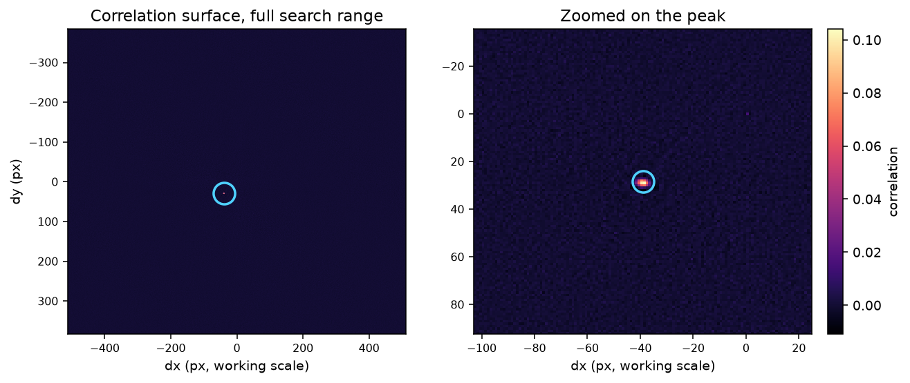
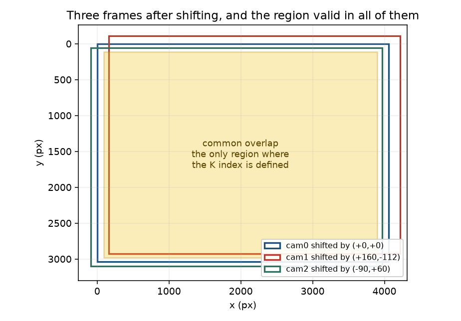

# Why alignment is needed at all

The K-index is evaluated **per pixel**:

$$\delta_{77}(x,y) = \frac{S_{770}(x,y) - C_{770}(x,y)}{C_{770}(x,y)},
\qquad C_{770} = \tfrac{1}{3}\left(S_{750}(x,y) + 2\,S_{780}(x,y)\right)$$

Every term is read at the same coordinate $(x,y)$. That is only meaningful if
$(x,y)$ refers to the same patch of ground in all three channels. It does not,
straight out of the camera, for two reasons:

1. The three cameras sit about 40 mm apart on the plate, so they view the
   scene from slightly different positions.
2. The multiplexer addresses one sensor at a time, so the three channels are
   exposed roughly two seconds apart. Anything the platform does in that
   window displaces the later channels relative to the first.

Alignment removes both, and then the region where all three overlap is the
only region where the index is defined.

# The geometric model

We assume the three images differ by a **translation only** — that the lines
of sight are parallel and the magnifications equal. That is an assumption, so
it was measured by fitting a full projective transform and reading off the
rotation and scale it wanted:

| | cam1 → cam0 | cam2 → cam0 |
|---|---|---|
| Rotation | −0.03° | −0.11° |
| Scale | 1.003 | 1.007 |

A rotation of 0.1° displaces a pixel at the frame edge by about 2 px, and a
0.5% scale error by about 10 px at the corner. Both are small next to the
translations we routinely correct, which run to hundreds of pixels. A
translation is therefore the right model, and adding rotation and scale terms
would fit noise rather than signal.

So for each channel $c$ we need one vector $(\Delta x_c, \Delta y_c)$.

# How the translation is estimated

**Not by identifying features.** Nothing in the pipeline looks for the stakes,
the H on the landing pad, or any other landmark. The method is *phase
correlation*, which uses every pixel at once.

## The mathematics

Let $f_0$ be the reference channel and $f_c$ another, and suppose they differ
by a pure translation:

$$f_c(x, y) = f_0(x - \Delta x,\; y - \Delta y)$$

By the Fourier shift theorem, a translation in space is a linear phase ramp in
frequency. Writing $F_0$ and $F_c$ for the transforms:

$$F_c(u, v) = F_0(u, v)\; e^{-i 2\pi (u \Delta x + v \Delta y)}$$

The magnitudes are identical; the shift lives entirely in the phase. So form
the **normalised cross-power spectrum**, which divides the magnitude out and
keeps only that phase difference:

$$R(u,v) = \frac{F_0(u,v)\, \overline{F_c(u,v)}}
                {\left| F_0(u,v)\, \overline{F_c(u,v)} \right|}
        = e^{\,i 2\pi (u \Delta x + v \Delta y)}$$

The inverse transform of a pure phase ramp is a delta function at the shift:

$$r(x,y) = \mathcal{F}^{-1}\{R\} = \delta(x - \Delta x,\; y - \Delta y)$$

so the estimate is simply the location of the peak:

$$(\Delta x, \Delta y) = \arg\max_{x,y}\; r(x,y)$$

In practice $r$ is not a perfect delta — the images are not related by an
exact translation, they contain noise, and the scene changes a little between
exposures — but it is a sharp peak on a flat floor.

## Why normalise the magnitude

Dividing by $|F_0 \overline{F_c}|$ is what makes this robust for our case.
It discards how *much* signal there is at each frequency and keeps only
*where* it is. A channel that is uniformly brighter, or one that sees a
different continuum level because it looks through a different filter,
produces the same phase ramp. The estimate is therefore insensitive to
exactly the per-channel gain differences the flat-field stage exists to
correct — the two stages do not have to be perfect for the other to work.

## Practical details

- **Windowing.** The transform assumes the image repeats periodically, so the
  discontinuity at the frame edge injects a cross-shaped artefact. A Hann
  window is applied to both frames first, tapering them to zero at the edge.
- **Local contrast equalisation.** CLAHE is applied before the transform.
  Channels that differ in overall brightness then contribute comparable
  structure.
- **Working resolution.** The estimate runs on a copy downscaled to 1024 px
  wide and the result is scaled back. The shift lives in the low frequencies,
  which survive downscaling intact, and this is roughly sixteen times faster.
- **Sub-pixel refinement.** The peak location is refined by taking the
  centroid of a small neighbourhood around the maximum, giving a fractional
  estimate rather than an integer one.

# A worked example

Capture `20260829_120138_954`, taken from the drone at roughly 15–20 ft:

| | measured shift | channel correlation before | after |
|---|---|---|---|
| cam1 → cam0 | (+159.84, −112.22) px | 0.739 | **0.981** |
| cam2 → cam0 | (+0.10, −0.15) px | 0.505 | 0.506 |

Two things are worth reading off this.

**cam1 needed a large correction and it worked.** A 160 px shift took the
correlation between the channels from 0.74 to 0.98.

**cam2 needed none.** Its shift is a tenth of a pixel, and the correlation is
unchanged because there was nothing to fix. Its lower correlation, 0.505, is
not misalignment — it is a genuine difference in what that channel recorded.

# Extracting the overlap

Once each channel has been shifted onto the reference, the frames no longer
cover the same rectangle: shifting leaves an invalid strip along the edges
where the sensor had no data. The usable region is the intersection.

For a frame $W \times H$ and shifts $(\Delta x_c, \Delta y_c)$:

$$x_0 = \max_c \left(0,\, -\Delta x_c\right), \qquad
  x_1 = W - \max_c \left(0,\, \Delta x_c\right)$$
$$y_0 = \max_c \left(0,\, -\Delta y_c\right), \qquad
  y_1 = H - \max_c \left(0,\, \Delta y_c\right)$$

Every channel is cropped to $[x_0, x_1) \times [y_0, y_1)$. Outside it at
least one channel has no data, so $\delta_{77}$ is undefined there and is not
computed.

# What this costs in practice

Measured across 30 usable airborne triplets from the 2026-08-29 flight:

| | |
|---|---|
| Needed no correction (< 8 px) | **23 of 30** — typical residual 0.1–0.8 px |
| Needed a real correction | 7 of 30 — between 100 and 790 px |

The 23 are the important number. **At operating distance, with the aircraft
momentarily steady, the three channels already land on top of each other to a
fraction of a pixel.** The cameras are co-boresighted; there is no fixed
pointing error to remove, and the overlap is essentially the whole frame.

The seven are captures where the aircraft moved during the two-second
sequence. On the worst of them the crop removes about 30% of the frame.

This is why the shift is estimated per capture rather than measured once and
applied. A fixed calibration would be right for the 23 and badly wrong for
the 7, and nothing in the image tells you in advance which one you have.

# Where a single translation is not enough

Two cameras separated by a baseline $B$, with focal length $f$ in pixels,
viewing a point at distance $Z$, see it displaced by

$$d = \frac{B f}{Z}$$

This depends on $Z$. If everything in the scene is at about the same
distance, $d$ is effectively constant and a single translation absorbs it.
If the scene has depth, different parts need different shifts and no single
translation satisfies them all.

For our 40 mm baseline:

| Lens | 0.5 m | 1 m | 2 m | 5 m | 10 m | 30 m |
|---|---|---|---|---|---|---|
| 4 mm | 83 px | 42 px | 21 px | 8 px | 4 px | 1 px |
| 6 mm | 125 px | 62 px | 31 px | 12 px | 6 px | 2 px |
| 8 mm | 166 px | 83 px | 42 px | 17 px | 8 px | 3 px |

At flight altitude parallax is a pixel or two across the whole scene and the
translation model is exact for all practical purposes. At a metre it is tens
of pixels and varies across the frame.

The consequence is measurable. Searching exhaustively for the best possible
single shift — not the one the estimator happens to pick, but the optimum:

| Scene | Best achievable alignment |
|---|---|
| Foliage about 1 m away, on the bench | NCC **0.483** |
| Ground from the drone, 15–20 ft | NCC **0.926** |

The bench figure is not an estimator failure. No translation does better,
because the model itself is wrong for that scene.

**For close-range work the practical answer is to keep the subject and its
backdrop at similar distance.** The burn setup already does this — the
charcoal tray and the black backdrop are roughly coplanar — so parallax is
close to constant across the frame and a single translation absorbs it. A
scene with genuine depth variation a metre away would need per-pixel
registration, which is a different and much heavier method.

# A landmark method as an independent check

An alternative approach is to identify common points — the H on the landing
pad, survey stakes — in all three images and solve for the offset from their
coordinates.

We do not use this as the primary method, for one reason: **the scenes we
care about have no landmarks in them.** A fire in open scrub contains nothing
recognisable to match, and a method that depends on identifiable objects
fails exactly where the instrument is meant to work. Phase correlation needs
only texture, which burning vegetation has in abundance.

It is genuinely useful as a **check**, though. Imaging a target with
recognisable points at a known distance would measure the fixed
camera-to-camera geometry directly, independently of phase correlation, and
confirm the co-boresighting result above by a second route. That is worth
doing once, and the landing pad is a suitable target.

# What the tool produces

`tools/register_triplets.py` takes a directory of captures and writes, per
capture event:

- the three channels aligned onto the reference and cropped to the common
  overlap, at identical dimensions, ready for per-pixel arithmetic;
- a report giving the shift for each channel and the correlation before and
  after, so every fit shows its own work;
- optionally a false-colour composite for visual checking — one channel per
  colour plane, so residual misalignment appears as coloured fringing.

Captures it cannot align confidently are flagged rather than silently
accepted. The usual cause is a saturated or featureless frame: phase
correlation needs structure, and a blown-out frame has none.
