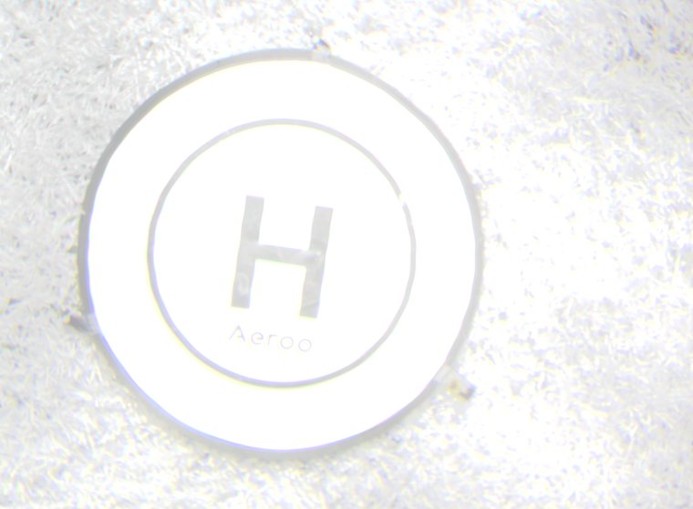
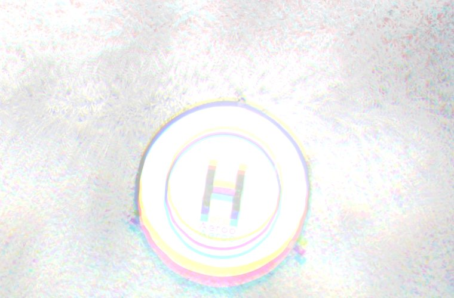
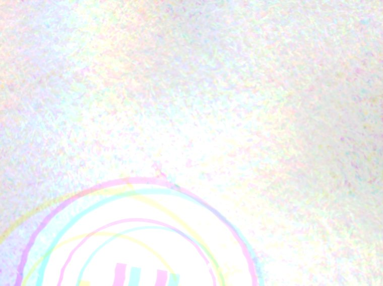

# Alignment walkthrough

How to run the channel alignment yourself, and how to read what it tells you.
Four commands, then a look at the results from the 29 August flight.

For the method and the mathematics behind it, see
[`alignment_method.md`](alignment_method.md). This page is the practical
version.

---

## 1. Set up

You need Python 3.9 or newer. Nothing else — no compiler, no system packages.

```bash
git clone https://github.com/ngrabbs/koenig_wildfire.git
cd koenig_wildfire

python3 -m venv .venv
.venv/bin/pip install -r tools/requirements.txt
```

That installs numpy, OpenCV and matplotlib. On Apple Silicon they all arrive
as prebuilt wheels, so it takes about a minute.

Check it worked:

```bash
.venv/bin/python tools/register_triplets.py --help
```

## 2. Point it at some captures

The tool reads a directory of frames named the way the payload writes them:

```
20260829_120658_759_cam0_762nm.jpg
20260829_120658_759_cam1_766nm.jpg
20260829_120658_759_cam2_770nm.jpg
└── capture event ──┘ └cam┘ └label┘
```

It groups them into triplets by the timestamp prefix, so a folder holding
many capture events is fine. Anything not matching that pattern is ignored.

> The wavelength in the filename is the **intended** filter assignment, not a
> measurement. No filters were fitted for these captures, so all three
> channels recorded the same broadband light.

## 3. Look before you write anything

```bash
.venv/bin/python tools/register_triplets.py ./flight_images --report-only
```

This estimates the shifts and reports them without writing any files. It is
the quickest way to see which captures are usable.

```
7 capture events in flight_images

  20260829_120638_759  cam1: dx= -272.6 dy=   -2.2 (ncc 0.36->0.56 t=8.3)   cam2: dx= -103.8 dy=  -30.6 (ncc 0.43->0.72 t=8.3)
  20260829_120648_759  cam1: dx=  -94.4 dy= +281.6 (ncc 0.33->0.69 t=12.6)  cam2: dx= -134.0 dy= +383.3 (ncc 0.29->0.59 t=12.6)
  20260829_120653_759  cam1: dx=  -31.0 dy= +141.2 (ncc 0.46->0.72 t=14.5)  cam2: dx=  -72.8 dy= +140.2 (ncc 0.46->0.60 t=14.5)
  20260829_120658_759  cam1: dx=  +43.8 dy=  +37.2 (ncc 0.57->0.93 t=14.6)  cam2: dx=  +53.6 dy=  +96.9 (ncc 0.45->0.75 t=14.6)
  20260829_120708_759  cam1: dx= -107.8 dy= -534.7 (ncc 0.24->0.58 t=23.0)  cam2: dx= -253.8 dy= -196.1 (ncc 0.31->0.51 t=23.0)
  20260829_120713_759  cam1: dx=  +79.0 dy=  -35.4 (ncc 0.54->0.71 t=23.4)  cam2: dx= +178.9 dy= -144.1 (ncc 0.41->0.60 t=23.4)
  20260829_120723_759  cam1: dx=   +4.2 dy=   +2.9 (ncc 0.45->0.44 t=14.2)  cam2: dx=   +3.6 dy=   -3.9 (ncc 0.29->0.29 t=13.8)   [LOW CONFIDENCE]

6 registered, 1 low-confidence, 0 incomplete, 7 total
```

### Reading a line

| Field | Meaning |
|---|---|
| `dx`, `dy` | pixels this channel was moved to land on cam0 |
| `ncc 0.36->0.56` | how well the channel matched cam0 **before** and **after** the shift |
| `t=8.3` | how much texture the frame has. Phase correlation needs structure; a blown-out or blank frame has none |
| `[LOW CONFIDENCE]` | the fit did not convince. The shift is reported but should not be trusted |

**The `ncc` pair is the number that matters.** It is the fit showing its own
work: a shift that helps raises it, a shift that does nothing leaves it flat.

## 4. Write the aligned frames and the composites

```bash
.venv/bin/python tools/register_triplets.py ./flight_images -o ./aligned --composite
```

Per capture event you get:

- three aligned channels, cropped to the region present in all three, at
  identical dimensions — ready for per-pixel arithmetic;
- a **composite**, which is a check image, not a product.

### How to read a composite

The three aligned channels are loaded into the red, green and blue planes of
one picture. Since all three cameras recorded the same broadband light:

- **aligned** → the three planes agree → the image looks grey;
- **misaligned** → the planes disagree at every edge → coloured fringes.

Colour in a composite is misalignment made visible. It is a diagnostic, and
should not be used for measurement.

---

## The seven captures, and what they show

### Well aligned — `20260829_120658_759`

```
cam1: dx= +43.8 dy= +37.2   ncc 0.57 -> 0.93
cam2: dx= +53.6 dy= +96.9   ncc 0.45 -> 0.75
```



Small corrections, and the correlation rises sharply — cam1 to 0.93. The
landing pad and the H read as neutral grey with clean edges. This is what a
good alignment looks like.

### Partly aligned — `20260829_120708_759`

```
cam1: dx=-107.8 dy=-534.7   ncc 0.24 -> 0.58
cam2: dx=-253.8 dy=-196.1   ncc 0.31 -> 0.51
```



Much larger corrections — cam1 moved over 500 px — and the alignment
genuinely improved, roughly doubling both correlations. But look at the rim
of the pad: yellow on one side, pink and blue on the other. The bulk of the
frame is registered and the edges are not quite.

The aircraft was moving during this capture. A shift of 535 px between two
channels is the drone travelling during the two seconds between exposures.

### Failed — `20260829_120723_759`

```
cam1: dx=  +4.2 dy=  +2.9   ncc 0.45 -> 0.44
cam2: dx=  +3.6 dy=  -3.9   ncc 0.29 -> 0.29     [LOW CONFIDENCE]
```



Every edge is a rainbow. The pad's circle is drawn three times in magenta,
cyan and yellow, and the H is split into coloured bars.

The numbers said so before the picture did. Both channels report a shift of
a few pixels, and **the correlation does not change** — 0.45 to 0.44, 0.29 to
0.29. A correction that improves nothing did not find the right answer. That
is what earns the `[LOW CONFIDENCE]` flag.

## Why that one failed

Not a tuning problem. Fitting a full transform — allowing rotation and scale,
which the aligner does not — shows what the capture actually needed:

| | rotation | scale |
|---|---|---|
| cam1 | −1.31° | 0.981 |
| cam2 | +0.68° | **1.073** |

A scale of 1.073 means the camera was 7% closer to the ground for one channel
than the other: **the aircraft changed altitude during the capture**, and
rotated about a degree while doing it.

The aligner corrects translation only. It has no rotation term and no scale
term, so it cannot represent what happened. Searching exhaustively for the
best possible translation on this pair reaches a correlation of only 0.227 —
the right answer does not exist within the model.

That is also why the reported shift is a few pixels rather than a few
hundred. Phase correlation produces a sharp peak only when two frames really
are related by a shift. Rotate one by a degree and rescale it by 7%, and the
peak dissolves into the noise; the estimator then locks onto a spurious one
near zero.

**This capture is not recoverable.** It should be discarded rather than
corrected — which is exactly what the flag is telling you.

---

## What this means in practice

Of 30 usable triplets from the flight, **23 needed no correction at all** —
the three channels already landed within a fraction of a pixel of each other.
The cameras are well co-boresighted and their lines of sight are parallel;
at operating distance the overlap is essentially the whole frame.

The captures that need a large correction, and the occasional one that cannot
be corrected, are all the same cause: the multiplexer can only address one
sensor at a time, so the three channels are exposed about two seconds apart,
and whatever the aircraft does in that window displaces them.

The real fix is not a better aligner. It is a shorter gap between the three
exposures — which is why hardware-triggered simultaneous capture is the most
valuable open item on the payload.

## Next stage

Aligned triplets feed the K-index:

```bash
.venv/bin/python tools/k_index.py ./aligned -o ./kindex
```

which computes, per pixel,

```
δ77 = [S770 − ⅓(S750 + 2·S780)] / [⅓(S750 + 2·S780)]
```

and writes an index map plus a three-point spectral plot. With no filters
fitted it returns noise about zero, as it should — every channel is seeing
the same light.
