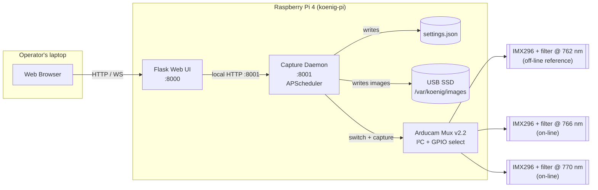

# Purpose of this document

What got built, and *why* it got built that way. Intended audience: any
developer joining the project who needs to make a non-trivial change
and shouldn't have to re-derive the design decisions from scratch.

The user-facing manual is `operator_manual.md`. The physics is in
`k_line_primer.md`. This doc is for everyone else.

# What the system is

A single Raspberry Pi 4 drives three InnoMaker IMX296RAW global-shutter
cameras through an Arducam Multi Camera Adapter v2.2 (a CSI multiplexer).
A Flask-based web UI on the Pi lets an operator's laptop browser trigger
captures, review images, and configure the cameras. Storage is local to
the Pi (USB-SSD recommended for sustained timer-mode runs). The Pi
either joins a known wifi network or — if none is available — falls
back to an AP-mode hotspot called `satnet`.



## What used to be here (and why it's gone)

The pre-rewrite architecture was four boards: three Raspberry Pi Zero
2 W camera nodes + one ESP32 + SIM7600 flight controller, talking LTE
to a Flask C2 server on the ground. Each Pi Zero ran its own copy of
`capture_uplink.py`, listened on a GPIO trigger, and shipped images via
UART to the ESP32 for re-transmission.

The system worked but was painful to lab — four boards to flash, four
SD cards to manage, three UARTs to keep wired correctly, and an LTE
stack to bring up before any ground test. For the drone use case in
particular, four boards' worth of weight and wiring was overkill.

The retired code is in `../legacy/` and the last snapshot is tagged
`v0.2-his-final-snapshot`.

# Design decisions

## Daemon + UI split (not a mega-Flask)

The capture daemon owns the camera handles, the mux state, the
scheduler, and the on-disk image store. The Flask UI is purely a view
layer that talks to the daemon over local HTTP.

**Why.** Three things fall out cleanly:

1. The UI can crash or restart without losing an in-flight timer run.
2. Other clients (a CLI, a future drone ground station, an
   integration-test harness) can drive the daemon without re-implementing
   capture logic.
3. The daemon's state is centralised — there is one queue, one mux
   selector, one settings file. No two-Flask-workers-racing-each-other
   bugs.

The cost is two services to ship instead of one. Worth it.

## Sensor pick: IMX477 today, IMX296 as a future option

We had both on the bench. IMX296RAW is the *better* sensor for this
payload — global shutter (motion-immune for the drone), monochrome
RAW (no Bayer-debayer loss in the NIR window), smaller frames (7× less
storage, faster mux-switch settle time). The primer calls out IMX296
by name.

**But in Phase 3 we shipped IMX477** for one practical reason: the
stock Pi OS `camera-mux-4port` overlay supports IMX477 (and many
other sensors), but ships no `imx296.dtsi` and therefore no IMX296
support through the multiplexer. Adding it requires writing a
sensor `.dtsi` from scratch — a few hundred lines of dts and
non-trivial validation. IMX477 worked out of the box (modulo our
i2c-routing patch — see overlay section below) so we took the win.

Switching is a swap of cameras plus one line in
`/boot/firmware/config.txt`
(`cam0-imx477` → `cam0-imx296`, etc.) once the `imx296.dtsi` exists.
Both sensors stay supported by our Python daemon — `Picamera2` is
agnostic, the mux switching is in the kernel.

The IMX296 work is a follow-up in
[`pi/dtoverlay/README.md`](../pi/dtoverlay/README.md).

## Arducam Multi Camera Adapter v2.2 (and the simultaneity tradeoff)

The v2.2 is a CSI **switch**, not a true multiplexer. The Pi's CSI
controller sees one camera at a time. To capture all three filters, the
daemon must: select cam 0 via I²C + GPIOs, capture, select cam 1,
capture, select cam 2, capture. Total cycle time is dominated by
sensor re-init between switches (target ≤ 100 ms per channel,
≤ 300 ms total).

**This is a step backward from the old 3-Pi-Zero architecture**, where
a single GPIO trigger fired all three cameras within microseconds. For
a moving drone over a fire, the scene shifts between channels and the
ratio math `(S766 + S770) / (2·S762)` gets noisier. Mitigations:

- Minimise per-channel cycle time (fast switching + minimal sensor
  re-init).
- Post-hoc image registration during Stage-1 processing on the ground
  (correlate features between channels and warp into alignment).
- Operationally: fly slowly, hover, or accept that brief drift.

The Camarray HAT product (Arducam) would restore hardware-synchronised
capture but at a price the project couldn't justify. If the science
team finds the registration noise unacceptable in flight data, that's
the upgrade path.

## Settings: shared by default, advanced per-camera override with a warning

The ratio math only works if all three channels are radiometrically
comparable. If a student changes exposure on camera 0 and not on the
others, every subsequent capture is scientifically invalid.

The UI's default settings panel applies one set of values to all three
cameras. An **Advanced** toggle reveals per-camera fields, accompanied
by a red banner that says *"Per-camera settings active — ratio
measurement invalid."* That banner stays visible everywhere (gallery
view, capture page) until Advanced mode is turned off.

Justification: students misconfiguring the cameras is the most likely
failure mode for the science. We make the safe path the default and the
unsafe path loud.

## Burst and timer concurrency: busy → reject

There is one capture queue. If the operator clicks **Capture** while a
timer-triggered burst is in flight, the request is rejected with a
toast (`"Busy — capture already running"`). Same in the other
direction: if a manual burst is running and the timer fires, the timer
tick is dropped (and logged).

No priority queue, no preempt, no buffering. Simpler is enough for the
known use cases — and a queued-up backlog of stale captures is worse
than dropped ticks.

## Storage and auto-prune

A 20-shot burst × 3 cameras × ~1 MB per IMX296 monochrome RAW ≈ 60 MB.
Timer mode at one burst per second fills a 64 GB SD card in roughly
fifteen minutes of running. Two mitigations:

- The recommended deployment is a USB SSD mounted at `/var/koenig/images`.
- The UI shows a live disk-usage bar. Settings include a **"Keep most
  recent N captures"** auto-prune that the daemon enforces.

## Wifi: known network or AP fallback

On boot, the Pi tries to connect to known wifi networks via
NetworkManager. If none come up within a timeout, it brings up an AP
named `satnet` on `192.168.4.1` (password `cubesat1`). The operator
joins that network and points their browser at
`http://192.168.4.1:8000`.

This is the same approach the legacy `software/satnet/` scripts used —
the script gets ported into `pi/systemd/` and wrapped with the
"try-known-first, fall-back-to-AP" boot logic.

## Auto-start on boot

Both the daemon and the UI run as systemd services so students never
need to SSH in. Unit files live in `pi/systemd/`. Logs go to journald;
the UI surfaces a "view logs" tail for diagnostics.

# Implementation phases

| Phase | Goal | Deliverable |
|---|---|---|
| 0 | Savepoint + reorganise | **done** — Tag `v0.2-his-final-snapshot`, legacy/ archive, new skeleton, single commit. |
| 1 | Docs scaffold | **done** — This document, operator manual stub, hardware setup stub, `make pdf` toolchain, end-to-end PDF build verified. |
| 2 | **done** — Single-camera capture spike | One IMX296 directly on the Pi, no mux. Capture button + image gallery + delete. Re-creates the old `image_dashboard/` functionality on the new stack. |
| 3 | **done** — Add the mux | Custom `koenig-mux-4port` dtoverlay (stock overlay patched for i2c-1 routing). Sequential three-channel burst via Picamera2 + kernel video-mux. Three IMX477s through Arducam v2.2 HAT. |
| 4 | Settings + burst + timer | **4a done** — `settings.json` schema, shared-default form, Advanced/per-camera override with warning banner. **4b done** — burst-count parameter, APScheduler timer mode, busy → 409. **4c remaining** — disk-usage display + "keep most recent N" auto-prune. |
| 5 | Focus mode and field networking | **done** — Per-camera MJPEG live stream with full-screen view (Phase 5a) and AP-fallback wifi via a single NetworkManager profile (Phase 5b — `pi/network/install-ap-fallback.sh`). |
| 6 | Operator-manual finalisation | Fresh student walks the doc, screenshots collected, troubleshooting filled in from observed failures, v1.0 PDF tagged. |

Each phase ends with: working build + updated `operator_manual.md` +
a tagged commit.

# Code layout (target — fills in over Phases 2–5)

```
pi/
├── daemon/
│   ├── __init__.py
│   ├── main.py           ← entrypoint; starts HTTP server + scheduler
│   ├── camera.py         ← Picamera2 wrapper, per-camera settings apply
│   ├── mux.py            ← Arducam v2.2 select logic (I²C + GPIO)
│   ├── capture.py        ← orchestrate "burst of N across 3 channels"
│   ├── scheduler.py      ← APScheduler integration (timer mode)
│   ├── store.py          ← image directory mgmt, auto-prune, disk-usage
│   └── api.py            ← /capture, /settings, /images, /preview
├── webui/
│   ├── __init__.py
│   ├── app.py            ← Flask app, talks to daemon at :8001
│   ├── templates/
│   └── static/
├── shared/
│   ├── settings.py       ← settings schema + load/save
│   └── ipc.py            ← thin HTTP client to the daemon
├── systemd/
│   ├── koenig-daemon.service
│   ├── koenig-webui.service
│   └── koenig-ap-fallback.service
└── tests/
```

# Cross-references

- [`operator_manual.md`](operator_manual.md) — student-facing usage doc.
- [`hardware_setup.md`](hardware_setup.md) — first-boot Pi setup,
  dtoverlay, wiring.
- [`k_line_primer.md`](k_line_primer.md) — the physics.
- [`../legacy/README.md`](../legacy/README.md) — the retired architecture.
