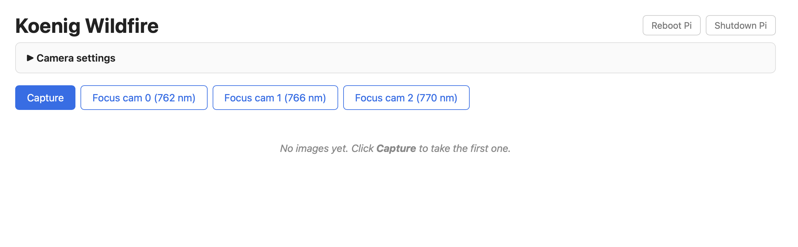
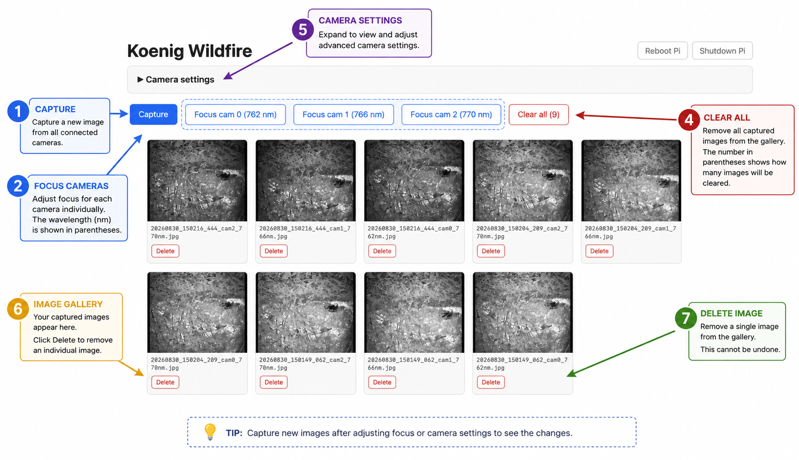
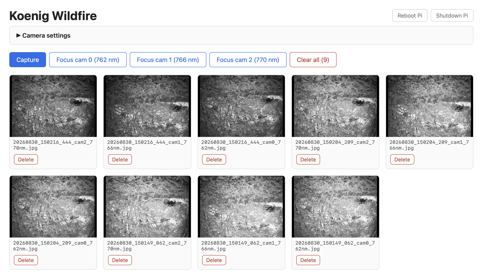
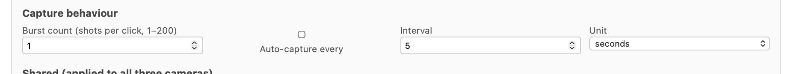
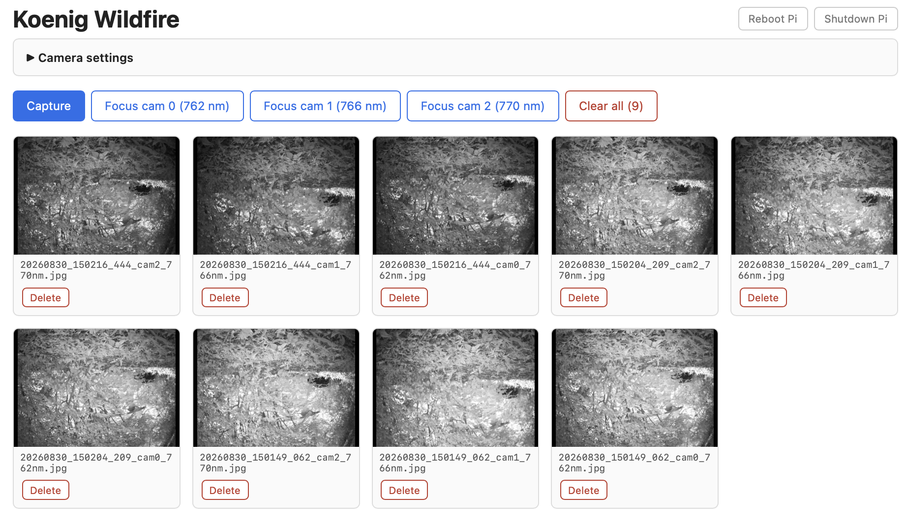
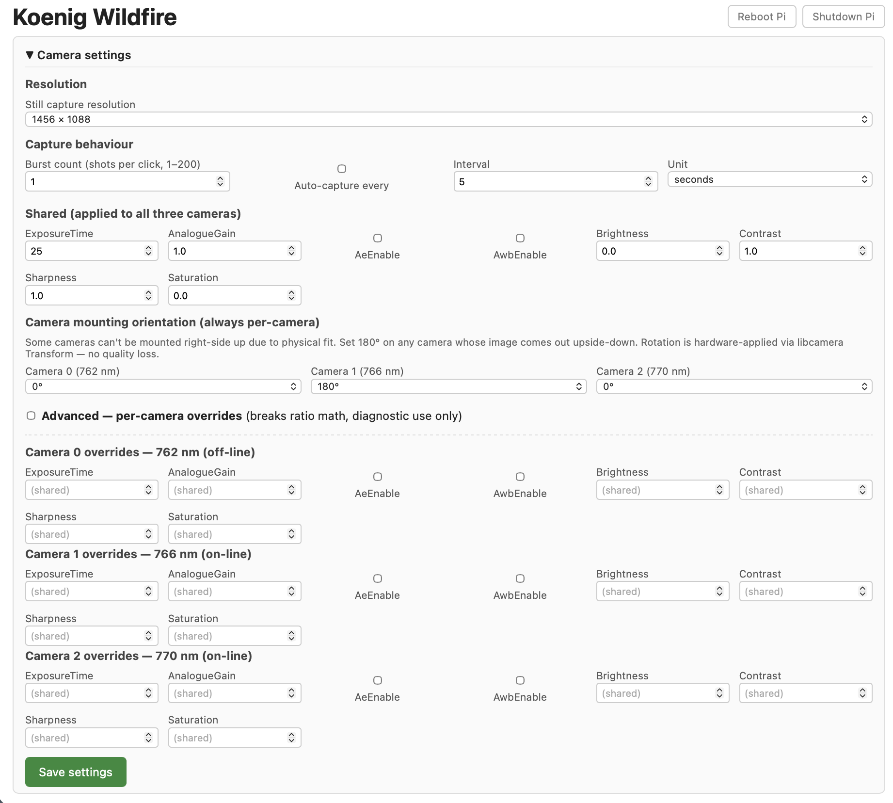

# About this manual

This is the user-facing guide for operating the the payload camera
payload from a laptop. It assumes:

- You have the assembled payload (Raspberry Pi 4 + Arducam multiplexer
  + three cameras with narrowband filters) powered and booted.
- You have a laptop with a modern web browser.
- You have **no prior Linux or networking experience** — anything we need
  you to know is explained here.

If something in this manual doesn't match what you see on screen, the
manual is wrong — please tell whoever handed you the gear, and check
that you're on the latest version (the version line at the top of this
PDF tells you when it was built).

> **Status — field-ready.** Capture, gallery, delete, settings, burst,
> timer, focus mode, and AP-fallback wifi all work and have been flown.
> There is no automatic storage cleanup yet — see the troubleshooting
> entry on disk space before a long unattended run.

# Quick start

> **Important — no filters are fitted yet.** All three cameras work,
> but the narrowband filters have not arrived (they bolt onto the lens
> housings; there is nothing electrical to connect).
> Pictures all show the same scene with no spectral difference until
> filters are installed. The capture pipeline doesn't care — when you
> bolt the filters on, the science begins automatically.

1. **Power on the Pi.** Plug in the USB-C power cable. Wait about 30
   seconds for it to boot.
2. **Connect your laptop to wifi.** Two cases:
   - **In the lab:** join the same wifi network the Pi knows. The Pi
     joins it automatically on boot.
   - **In the field (no known wifi):** wait about a minute after
     boot, then join the wifi network called **`satnet`** (password
     **`cubesat1`**) that the Pi broadcasts on its own. This network
     is "the Pi"; you won't have internet on your laptop while
     joined to it.
3. **Open your browser**:
   - In the lab: `http://payload-pi.local:8000` (or the Pi's IP).
   - In the field on satnet: `http://192.168.4.1:8000` (or
     `http://payload-pi.local:8000`).
4. **Click Capture.** Three pictures appear in the gallery, one per
   camera (you can tell them apart by the `cam0_762nm`, `cam1_766nm`,
   `cam2_770nm` suffix in each filename). The first burst takes ~8
   seconds while the cameras warm up; subsequent bursts are faster.

# What this thing does (one paragraph)

The payload takes three pictures of the same scene through three
different narrowband filters: 762 nm, 766 nm, and 770 nm. Burning
vegetation releases potassium vapor that glows brightly at 766 nm and
770 nm but **not** at 762 nm. By comparing the three pictures
pixel-by-pixel, the science team can pick out fires against everything
else in the scene. You don't need to do this comparison yourself — your
job is to **capture good pictures**, which means: get the focus right,
get the exposure right, and frame the target. The math happens after.

The full physics is in the K-line primer (separate document) if you're
curious.

# Interface walkthrough

Everything the operator needs is on one page. There is no menu and no
login — open the address in a browser and the whole interface is in
front of you.

## The main page

| # | Element | What it does |
|---|---|---|
| 1 | **Capture** button | Takes one picture, adds it to the gallery below. |
| 2 | **Clear all** button | Deletes every image in the gallery (asks first). |
| 3 | Image card | A thumbnail of one captured picture, with its filename and a per-image **Delete** button. Click the thumbnail to open the full-size image in a new tab. |

The filename of each picture is its UTC timestamp:
`YYYYMMDD_HHMMSS_mmm.jpg`. Sort order in the gallery is newest first.

## Capturing pictures

### Single capture

Click the blue **Capture** button. After about **8 seconds** the
gallery refreshes with three new pictures on top — one per channel,
labeled in the filename as `cam0_762nm`, `cam1_766nm`, and
`cam2_770nm`. The three filenames share the same timestamp prefix so
they always group together when the gallery is sorted by name.

Why it takes 8 seconds: the three cameras share one CSI data lane
through the multiplexer. The Pi has to capture from camera 0, switch
the mux, capture from camera 1, switch again, and so on. There's no
way around the sequential timing without different hardware.

If the page seems to hang past 15 seconds, something's wrong — see
the troubleshooting section.

### Burst capture

Open the **Camera settings** panel and set **Burst count** to however
many shots you want each click to take. Save. Now each click of
**Capture** runs that many three-channel bursts back-to-back. The
file gallery shows them all, grouped by burst (each burst has its own
timestamp prefix; cam0/cam1/cam2 within a burst share that prefix).

Roughly **~1.5 seconds per burst** once the system is warmed up. So a
burst-of-10 takes ~15 seconds and produces 30 images. A burst-of-100
takes ~150 seconds and produces 300 images. The browser will appear
to "hang" for that whole time — that's normal, don't reload the page
while it's working.

### Timed (interval) capture

In the **Camera settings** panel under **Capture behaviour**, tick
**Auto-capture every** and set the interval (number + seconds/minutes
dropdown). Save. The Pi will start capturing automatically at that
interval and keep going until you uncheck the box and save again.

A yellow banner at the top of the page tells you the timer is on, and
restates the schedule:

> Auto-capture timer is **on** — capturing one 3-shot burst every 30 seconds.

The timer **survives a reboot** — if you leave it on and power the Pi
down, it'll resume capturing as soon as it comes back up. That's
intentional for "set it and forget it" drone use.

The timer fires `burst_count` bursts on each tick. So `burst_count=5`
+ timer every 2 minutes = 15 images every two minutes.

If a tick happens while the previous capture is still running (e.g.
burst_count is large and the interval is short), the new tick is
quietly dropped — no images are queued or duplicated.

## Reviewing pictures

Every capture lands in the gallery on the same page. Click any
thumbnail to open the full-size image in a new browser tab — from
there you can right-click and **Save As** to copy the file to your
laptop, or share the URL with someone else on the same network.

The gallery refreshes whenever you load or reload the page; it does
**not** auto-update while you're staring at it. Reload to see new
captures.

## Deleting pictures

There are two ways to delete:

- **One picture at a time:** click the **Delete** button on its card.
  Confirm in the popup. The page reloads with that picture gone.
- **All pictures:** click the **Clear all** button at the top. The
  count in parentheses tells you how many will be deleted. Confirm
  in the popup.

Deletion is immediate and **cannot be undone** — there is no recycle
bin. If you might need a picture later, save it to your laptop first.

## Changing camera settings

Click **Camera settings** at the top of the page to expand the panel.
Change what you need, then click **Save settings** at the bottom — nothing
takes effect until you save.

> **Important.** The science only works if all three cameras use the
> **same** exposure, gain, and white-balance settings. The default
> settings panel locks them together for this reason. There is an
> **Advanced** mode that lets you change settings per-camera — use it
> only for diagnostics, not for capture runs that go to the science
> team. The interface will show a red warning banner whenever Advanced
> mode is on.

## Focus mode

Focus mode shows live video from **one** camera so you can turn the
lens by hand and watch the image sharpen.

On the main page, next to **Capture**, there are three buttons:
**Focus cam 0 (762 nm)**, **Focus cam 1 (766 nm)**, and
**Focus cam 2 (770 nm)**. Click one. The browser switches to a
black full-screen view of that camera's live feed at about 15
frames per second.

Procedure:

1. Click the **Focus cam N** button for the camera you want to focus.
2. Turn the lens on that physical camera. Watch the image on screen.
3. Find the position where edges of your target look sharpest — they
   tend to "snap" into focus over a small range of lens rotation.
4. Click **Exit focus** (top-right) to return to the main page.
5. Repeat for the other two cameras.

> **If the view looks black, check the exposure before anything else.**
> Focus mode uses the same exposure as capture, and the cameras never
> adjust it themselves. An exposure set outdoors is far too short for an
> indoor target, and the live view comes up black even though the camera
> is working perfectly. Raise **ExposureTime** in **Camera settings** —
> it is in microseconds, so try multiplying it by five.

Because the three cameras share one data lane through the multiplexer,
you can only watch one at a time. Trying to capture or starting another
focus mode while one is active will show a red "busy" banner.

If you forget to click Exit and just close the browser tab, the Pi
notices the disconnect within a few seconds and releases the camera
automatically, so capturing still works on your next visit.

> **Known quirk — black image on the first focus click after boot.**
> Occasionally the very first focus session after the Pi has powered
> on (especially on **cam 0**) comes up as a completely black image,
> even though the camera and lens are fine. The fix is trivial: click
> **Exit focus**, then click the same **Focus cam N** button again.
> The second attempt comes up immediately. Subsequent focus sessions
> on any camera work first-click for the rest of the boot. This is
> a known software bug we haven't tracked down yet — it doesn't affect
> capture quality, just the live-preview pipeline.

# Operating the payload in the field

The payload is one rigid package — cameras, Pi and battery bolted
together on common standoffs — so it mounts and demounts as a single
unit. Whatever it is attached to, the routine is the same: power on,
join the wifi or its `satnet` access point, set exposure for the
conditions, focus each camera, then capture.

Two things are worth doing every time before you commit to a run:

1. **Take one test capture and look at it.** Exposure that was right
   yesterday is often wrong today.
2. **Check the gallery is empty enough** for the number of pictures you
   plan to take. Nothing deletes old ones for you.

## On a drone

## On a balloon

## In the lab

# Troubleshooting

*Sections will fill in as we encounter and fix the issues in practice.
What's listed here is the menu of likely problems.*

## "I can't connect to the wifi"

If you're trying to join `satnet` in the field and it isn't showing
up in your wifi list:

- Wait at least a minute after powering the Pi on. The Pi tries to
  reach known wifi networks first and only falls back to broadcasting
  satnet once those attempts fail.
- If you accidentally configured the Pi with a wifi network that
  *is* available where you are, the Pi will join that instead of
  starting satnet. Move out of range, or temporarily forget that
  network on the Pi (`sudo nmcli con delete <name>` over SSH from
  the lab).
- Verify the Pi is actually on by looking for its activity LED.

## "The web page won't load"

- **In the lab:** make sure your laptop and the Pi are on the same
  wifi network. Try the Pi's IP address (`http://<pi-ip>:8000`)
  instead of `payload-pi.local` — some networks block mDNS.
- **In the field on satnet:** confirm your laptop is connected to the
  `satnet` wifi (not your normal home/phone wifi). The URL is
  `http://192.168.4.1:8000`.
- If the page loads partially and then hangs, the Pi might be busy
  capturing a long burst — wait 30 seconds and reload.

## "Only one (or two) cameras show up"

If you click Capture and only get one or two pictures back instead of
three:

- **Most likely: a CSI ribbon is loose** between the multiplexer board
  and one of the cameras. Power off, reseat both ends of each ribbon,
  and try again. CSI ribbons are fragile and connectors don't always
  latch with an obvious click.
- **Second most likely: a ribbon is plugged in upside down.** Contacts
  on the camera end should face the camera PCB; contacts on the mux
  end should face the mux PCB. If you can see metal on the wrong side,
  flip it.
- **If reseating doesn't help:** SSH into the Pi and run
  `rpicam-hello --list-cameras`. You should see all three `imx296`
  entries. If one is missing, it's a hardware problem — that camera
  isn't being reached at all.

## "The pictures are all black" (or focus mode looks black)

Almost always **exposure**, not a fault. The cameras never adjust
exposure on their own — auto-exposure is deliberately switched off,
because the three channels have to expose identically for the
measurement to mean anything. So a setting that was right outdoors is
far too short indoors, and vice versa.

This bites hardest in **focus mode**, which uses the same exposure as
capture. Set the exposure on a bright scene outside, walk inside to
focus on a target, and the live view looks completely black — while the
cameras are working perfectly.

What to do:

1. Open **Camera settings** and look at **ExposureTime**. It is in
   **microseconds**, so `8000` is 8 milliseconds, not 8 seconds.
2. Multiply it by about 5 and save. Repeat until the picture looks
   right. Getting this wrong by 10x is normal and harmless.
3. As a starting point: bright sunlight needs a few hundred
   microseconds; an overcast day a few thousand; a dim room 10,000 or
   more. A dark target such as a cutting mat needs more still.

**All white instead** means the opposite — too much exposure. Come down
by the same factor. Beware that a washed-out picture has lost
information permanently: a saturated pixel records only "at least
maximum", so no amount of processing recovers it. When in doubt expose
darker, because an underexposed picture can be brightened afterwards.

> **A worked example.** A live focus view that appeared completely
> black turned out to be a dark cutting mat at 1500 microseconds,
> indoors.
> The frames were fine — mean brightness about 12% of full scale, which
> a laptop screen renders as black. At 8000 microseconds the same view
> was perfectly usable.

## "Focus mode shows a completely black image"

If this is the first focus session after the Pi booted, just **click
Exit and click the same Focus button again**. The second attempt comes
up live. After that, focus on any of the three cameras works
first-click for the rest of the boot. This is a known software bug
that doesn't affect captures.

If you see a black focus image *and* the double-click trick doesn't
help, check the obvious physical things on that camera:

- Lens cap on?
- Lens iris closed all the way? (Some lenses have a manual aperture
  ring — slide it to the open position.)
- Camera pointed at something completely dark?

## "It says 'busy' when I press capture"

This means a capture is already in progress — either an earlier click
hasn't finished, or the auto-capture timer just fired and is in the
middle of its run. Wait a few seconds and try again. Nothing's broken.

If you're using a large burst count or a short timer interval and you
constantly see this, either lower the burst count or lengthen the
interval so the system has time to finish one capture before the next
trigger comes.

## "I'm out of disk space"

There is **no automatic cleanup**. Nothing deletes old pictures for you,
so a long timed-capture run will fill the card and captures will start
failing.

A three-camera capture is roughly 300 KB at the current settings, so the
card holds a very large number of them — but timed capture at a short
interval adds up faster than you would expect. Before a long run:

1. Copy anything you want to keep to your laptop (click a thumbnail,
   then **Save As**).
2. Use **Clear all** on the main page to empty the gallery.

If captures are already failing, clear the gallery and try again. If
that does not help, ask whoever set the payload up to check free space
over ssh with `df -h`.

# Glossary

**Burst.** A group of pictures taken back-to-back from one button press.
You set the size (e.g. "burst of 10"); the system captures that many
through each filter before stopping.

**Capture.** One full set of three pictures, one per filter (762 / 766
/ 770 nm). All three share the same timestamp in their filenames so the
science team can match them up. Filename pattern is
`YYYYMMDD_HHMMSS_mmm_cam{N}_{wavelength}nm.jpg`.

**Filter.** A piece of glass in front of each camera that only lets
through light of one specific colour (wavelength). Our three filters
pass narrow slices of near-infrared light — invisible to your eyes but
visible to the cameras.

**Focus mode.** A live-video view of one camera, used so you can turn
the lens until the picture is sharp.

**Multiplexer (or "mux").** A circuit board that lets one Raspberry Pi
talk to three cameras one at a time. The Pi switches between cameras
electronically rather than having three Pis.

**Off-line / on-line.** The 766 nm and 770 nm cameras sit **on** the
potassium emission line — that's where fires show up. The 762 nm camera
sits **off** the line — that's the reference for "everything else."
The science team compares on-line vs off-line to find fires.

**K-line / potassium line.** The specific wavelengths of light that
glowing potassium atoms emit. Burning vegetation contains potassium,
which is why this works for wildfires.

# Where to get help

*(Contact info to be added.)*
