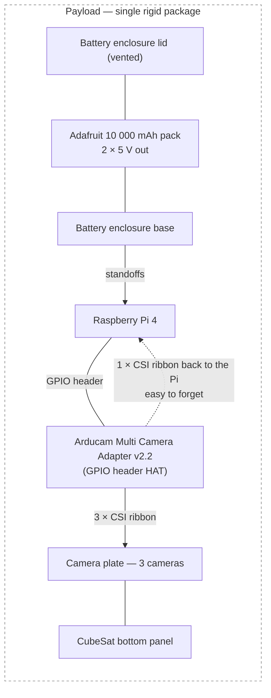
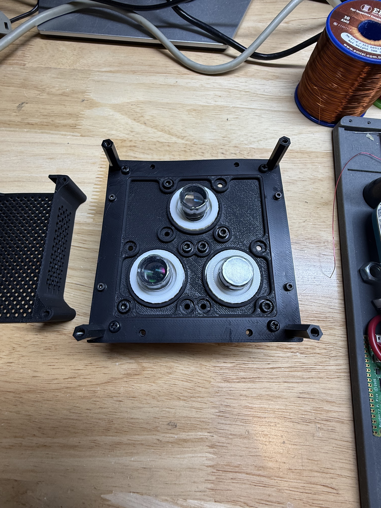
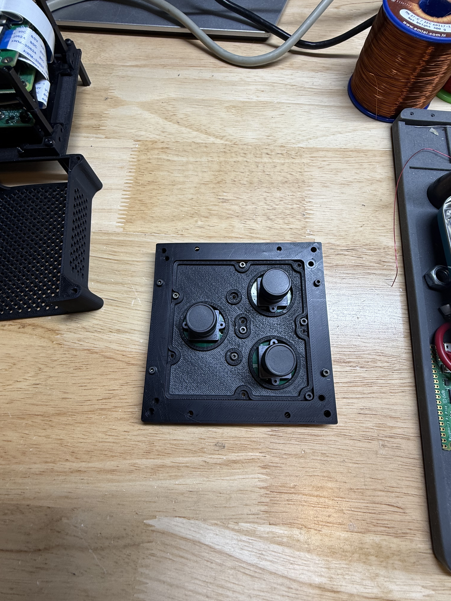
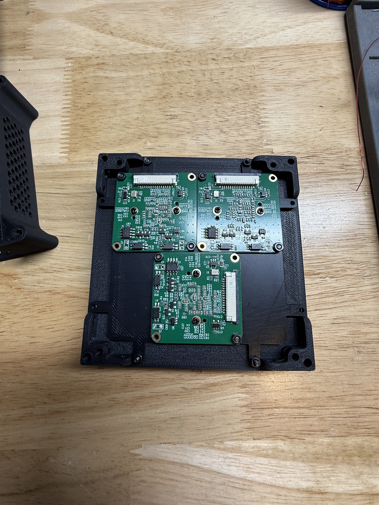
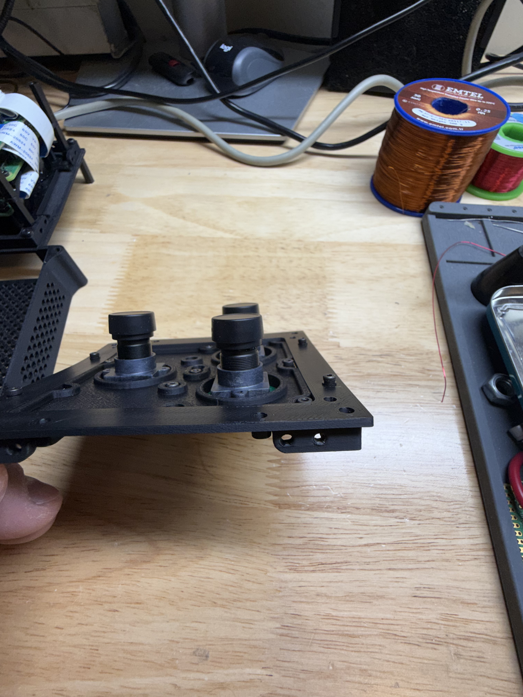
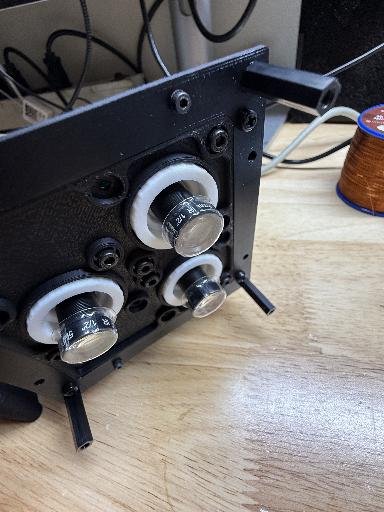
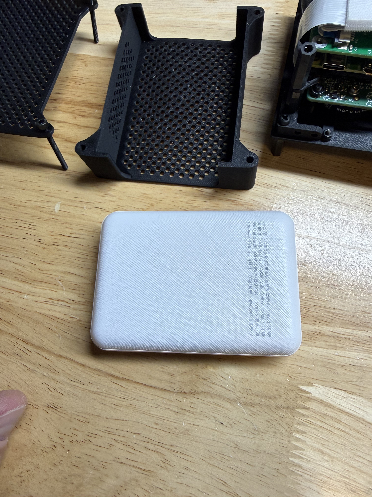

# Payload Build

*The physical stack: plates, cameras, optics, power, and what's still missing · 2026-08-28 — as-flown build*

## What this document is

This is the **physical** description of this payload: what
the parts are, how they stack, why they're arranged that way, and what is
still unfinished.

It is written for a capstone student who has just been handed the payload
and has not seen it before. If you want to *operate* it, read
[`operator_manual.md`](operator_manual.md). If you want to *configure a
fresh Pi*, read [`hardware_setup.md`](hardware_setup.md). If you want to
know *why we image potassium*, read [`k_line_primer.md`](k_line_primer.md).

> **Status.** The stack described here is assembled and flies as a single
> unit. The software is complete and field-tested. **The narrowband
> filters are not installed** — see [What is not built yet](#what-is-not-built-yet).
> Every image captured so far is broadband, not K-line.

## The payload at a glance


The payload is four subassemblies bolted into one rigid package on a
common set of standoffs, so it can be handed to a drone as a single
object with no loose cabling between parts.

| Layer | What it is | Construction |
|---|---|---|
| Bottom | CubeSat bottom panel | 3D print (real frame part) |
| Optics | Camera plate — 3 cameras looking down through it | 3D print |
| Middle | Standoffs | Machined/printed hex standoffs |
| Compute | Raspberry Pi 4 + Arducam Multi Camera Adapter v2.2 (HAT) | COTS, on standoffs |
| Power | Battery enclosure — base + vented lid | 3D print, screws into the same standoffs |

### Stack-up



Everything is structurally connected. Nothing hangs on a cable.

## The camera plates

**There are two camera plates, and they are not interchangeable.** This
is the single most confusing thing about the payload for a newcomer, so
read this section before touching hardware.

### Flight plate — Raspberry Pi HQ / IMX477



This is the plate that flies today. Three **Raspberry Pi HQ cameras
(IMX477**, 4056 × 3040, 12-bit colour Bayer) with the **IR-cut filter
removed** — mandatory, because the potassium K-line sits at 762–770 nm,
deep in the near-IR that the stock filter throws away.

Confirmed on the rig — `rpicam-hello --list-cameras` reports three
`imx477` at `4056x3040 12-bit RGGB`, hanging off `pca@70` (the PCA9544
I²C switch on the Arducam board).

**The lens mount is a custom part.** The Pi HQ camera ships with a large
C/CS mount, which is far too big for this plate and for the filter
holders. Each camera therefore carries a **3D-printed C/CS → M12 adapter**
that steps it down to a small M12/S-mount lens — the white printed
collars visible in the photo above. The lenses themselves are
IR-corrected 5 MP, 1/2" format; the markings `5MP … IR 1/2"` are legible
on the barrels below.

This adapter is load-bearing for the whole optical design: it is what
makes the HQ sensor compatible with M12 optics and, in turn, with the
bolt-on narrowband filters.

**Why this plate and not the better one:** the stock Pi OS
`camera-mux-4port` device-tree overlay supports IMX477 out of the box and
has no `imx296.dtsi` at all. **We have since written one** — see
[`../pi/dtoverlay/README.md`](../pi/dtoverlay/README.md) — so the remaining
blocker is fitting the plate, not software. Original reasoning in
[`architecture.md`](architecture.md) and
[`../pi/dtoverlay/README.md`](../pi/dtoverlay/README.md).

### Monochrome plate — IMX296 (working as of 2026-08-29)





Three **IMX296** global-shutter monochrome cameras. On paper this is the
*right* sensor for this payload:

- **Global shutter** — no rolling-shutter skew from a moving drone.
- **Native monochrome** — no Bayer filter, so no debayer interpolation
  loss in the narrow NIR band we actually care about.
- **Smaller frames** — roughly 7× less storage per capture, and faster
  settle time when the mux switches channels.

The K-line primer names IMX296 specifically. It could not be used through
the multiplexer at all until 2026-08-29, when the missing device-tree
support was written (`pi/dtoverlay/imx296.dtsi`). **This plate is now
fitted and working** — all three modules enumerate, capture through the web
UI, and stream in focus mode. Set with:

```
dtoverlay=payload-mux-4port,cam0-imx296,cam1-imx296,cam2-imx296
```

The modules are InnoMaker **CAM-IMX296RAW**, self-clocked from an onboard
54 MHz oscillator. Details and the failure modes to watch for are in
[`../pi/dtoverlay/README.md`](../pi/dtoverlay/README.md).

> **These modules have hardware trigger and strobe pins.** That is a
> potential answer to the biggest open problem on this payload — see
> [`flight_findings.md`](flight_findings.md).

### Focus mechanism — the mono plate is better

This is worth recording because it will drive a future design decision.





| | Monochrome plate | Flight (HQ) plate |
|---|---|---|
| Adjustment | Knurled collar on a threaded barrel | Thread the lens in and out by hand |
| Locking | Dedicated set screw | Friction only |
| Repeatability | Good — you can return to a setting | Poor — drifts if bumped |
| Fine control | Yes, the collar gives real mechanical advantage | No, the whole lens turns |

**The monochrome plate's adjuster is materially better and should be the
model for any future plate revision.** The flight plate's arrangement
works, but focus is set by turning the lens body itself, with nothing to
hold it. Once a camera is focused, treat it as fragile: it can be knocked
out of focus during handling and there is no visual indication that it
has moved.

Use the web UI's live focus mode (see the operator manual) to set focus,
and re-check all three cameras after transport, before every flight.

## Power



**Adafruit USB Battery Pack for Raspberry Pi — 10 000 mAh, 2 × 5 V
outputs.** The label reads 10 000 mAh / **37 Wh** nominal.

The pack sits in a printed enclosure with a vented lid, and the enclosure
screws into the same standoffs as the rest of the stack — so the battery
is a structural member, not a passenger.

**Power delivery is proven.** The rig has been bench-run on this pack,
and `vcgencmd get_throttled` reports `0x0` — no under-voltage, no
throttling, no brown-out events since boot. The pack drives the Pi 4
plus three cameras without complaint.

**Rough endurance:** a Pi 4 running the daemon, the web UI, and an active
MJPEG focus stream draws on the order of 4–6 W. Against 37 Wh nominal,
minus conversion losses, expect **roughly 4–6 hours** of field operation.
That is an estimate from the label — the throttling result is measured,
the runtime figure is not. Someone should time an actual discharge.

## As-configured capture settings

Read off the live rig (`~/.payload/settings.json`) on 2026-08-28:

| Setting | Value | Why |
|---|---|---|
| Resolution | 4056 × 3040 | Full sensor |
| `ExposureTime` | 50 000 µs (50 ms) | **Fixed** |
| `AnalogueGain` | 1.0 | **Fixed** |
| `AeEnable` | false | Auto-exposure **off** |
| `AwbEnable` | false | Auto-white-balance **off** |
| Rotation | cam 1 = 180°, cam 0 and 2 = 0° | cam 1 mounts upside-down |
| Burst count | 1 | Per capture click |
| Timer | disabled | Enable in the UI for drone runs |

Auto-exposure and auto-white-balance are **deliberately off**. If either
were on, each camera would pick its own exposure for the same scene and
the channel ratio would be meaningless. Do not turn them on.

Captures land in `~/payload_images/` on the Pi, named
`YYYYMMDD_HHMMSS_mmm_camN_WWWnm.jpg`.

> **The wavelength in the filename is a label, not a measurement.**
> Files are named `..._cam0_762nm.jpg`, `..._cam1_766nm.jpg`,
> `..._cam2_770nm.jpg` because that is the *intended* filter assignment.
> **No filters are installed yet**, so every image currently on the rig
> is broadband light through a channel that merely claims a wavelength.
> Anyone analysing this data without knowing that will produce nonsense.
> Treat all pre-filter captures as engineering data only.

## Open issue — the three channels are not radiometrically matched

**This is the most important open problem on the payload, and it is not
a software bug.**

A bench capture set from 2026-05-26 (`20260526_182128_363`) shows all
three cameras imaging the same indoor scene, at identical settings, with
identical framing. The mean luminance of each frame:

| Channel | Mean (0–255) | Relative |
|---|---|---|
| cam 0 (`762nm`) | 36.6 | 1.00× |
| cam 1 (`766nm`) | 36.6 | 1.00× |
| cam 2 (`770nm`) | 92.8 | **2.54×** |

Cameras 0 and 1 agree with each other almost exactly. **Camera 2 is about
two and a half times brighter than the other two** — same scene, same
exposure, same gain, no auto-exposure. The images are otherwise good:
well framed, in focus, and not clipped (cam 2 peaks at 203/255, so it is
bright but not saturated).

The likely cause is the **manual iris on cam 2's M12 lens being set
wider** than the other two, though sensor-to-sensor variation and
adapter seating could contribute.

### Why this matters

> **Correction, 2026-08-31.** The 2.5× figure above is not reliable. It
> came from comparing whole-frame means between cameras that frame
> slightly different parts of a scene, so it was largely measuring scene
> content rather than channel gain. Measured properly — same pixels of
> the same scene, after alignment — the three channels agree to **2.3%**
> on the IMX296 plate. The concern below is still the right concern; the
> magnitude was overstated.

The whole measurement is a ratio between channels, so a gain difference
between them is mathematically indistinguishable from real spectral
structure. Whatever its true size, it has to be measured against a
uniform target and divided out — that is what `tools/flat_field.py`
exists for.

### What to do about it

1. **Short term — check the irises.** If the M12 lenses have adjustable
   apertures, match them by eye and re-shoot the flat target until the
   three means agree.

2. **Proper fix — flat-field calibration.** Image a uniformly lit,
   featureless target (a white wall in even light, a grey card, ideally
   an integrating sphere) with all three channels at flight settings.
   Compute a per-channel scale factor that normalises the three means to
   each other, store it alongside the settings, and divide it out before
   computing any ratio. This also corrects vignetting and
   sensor-to-sensor response differences in one step.

3. **Re-do the calibration after the filters go on.** The filters have
   their own per-unit transmission efficiency, so the correction factors
   measured now will not be the right ones afterwards. The calibration
   that counts is the one taken through the full optical path.

**A flat-field capture is cheap — one shot of a blank wall.** It is worth
taking one before and after every flight day.

## What is not built yet

Be honest with anyone you hand this to. The following are **not done**:

1. **The narrowband filters are not installed.** Ordered 2026-08-29:
   Thorlabs `FBH750-10`, `FBH770-10`, `FBH780-10` — Ø25 mm, 10 nm FWHM,
   a bracketing set (770 nm on-line, 750 and 780 nm continuum
   references). They bolt onto the lens housings — no wiring, no
   electrical change. **Until
   they are on, every image this payload captures is broadband and the
   K-line ratio math is not being exercised at all.** Filter holder STLs
   are in [`../hardware/stl/`](../hardware/stl/) (`KK_FILTER_HOLDER_MKIII`).

2. **Disk auto-prune is not implemented.** There is no
   disk-usage display and no "keep most recent N captures" pruning. Not
   currently urgent — the rig runs a 117 GB card with 107 GB free, and a
   three-camera capture is about 3.5 MB — but a long unattended timer run
   still has nothing stopping it from filling the card.

3. **The channels are not radiometrically calibrated.** They agree to
   2.3% uncorrected, which is better than first thought, but the
   correction still has to be derived through the filters once fitted.

4. *(resolved 2026-08-29 — the IMX296 plate is fitted and working.)*

5. *(resolved 2026-08-31 — the operator manual is complete: seven
   figures, no remaining placeholders.)*

## Pre-flight checklist

Run this every time, in order. It is short on purpose.

- [ ] **Lens caps off — all three.** Easy to miss; one is capped in the
      photo above.
- [ ] **Pi ↔ mux ribbon cable seated.** The HAT does *not* route MIPI
      through the GPIO header. This cable has caused a lost evening
      before. Check orientation too — a flipped CSI cable fails silently.
- [ ] Power on, wait for boot.
- [ ] Join wifi. If no known network is present the Pi raises its own AP:
      SSID **`satnet`**, password **`cubesat1`**, browse to
      **`http://192.168.4.1:8000`**.
- [ ] `rpicam-hello --list-cameras` (or the UI) shows **three** cameras.
- [ ] **Focus each camera** using live focus mode, then don't bump the
      plate.
- [ ] **Known quirk:** the first focus click after a cold boot sometimes
      shows a black frame, usually on cam 0. Click **Exit focus**, click
      the same camera again — it comes up immediately, and every focus
      session afterwards works first-click. This is a known bug, not a
      hardware fault. It does not affect capture.
- [ ] Take one test capture. Confirm three images land in the gallery.
- [ ] **Shoot one flat field** — point the payload at an evenly lit blank
      wall and capture. This is your calibration reference for the day,
      and it takes ten seconds. See the radiometric section above.
- [ ] **Check free disk space** if you plan a long timer run — there is
      no auto-prune. (117 GB card, ~3.5 MB per three-camera capture, so
      there is a lot of headroom.)
- [ ] Set burst count and timer interval before takeoff. The intended
      drone workflow is: start a timer capture on the ground, fly the
      pattern, land, then review — do not try to fly *and* operate the UI.

## Next hardware tasks

For the incoming capstone team, roughly in order of value:

1. **Install and validate the narrowband filters.** Nothing about the
   science is proven until this happens. Everything else is secondary.

2. **Shoot a valid flat and apply the calibration.**
   `tools/flat_field.py` is written and validated; what is missing is a
   good flat. Two attempts failed instructively — saturated cloud, and a
   diffuser touching the lens which over-reported vignetting by 6–37%.
   Use a distant uniform source and `flat_field.py check` before
   trusting it.

3. **Fit the IMX296 plate and finish the sensor swap.** The device-tree
   work is **done** (2026-08-29) — `pi/dtoverlay/imx296.dtsi` plus the
   overlay build now offer `camN-imx296`, and the plumbing is verified as
   far as it can be without the hardware: the driver binds, resolves its
   clock and regulators, and reads the sensor ID over i2c. What remains is
   physical — fit the mono plate, set all three ports to `imx296` in
   `/boot/firmware/config.txt`, and confirm the modules run at 37.125 MHz
   INCK (there is a `camN-imx296-clk-freq` override for 54 MHz if not).
   This unlocks the better sensor *and* the better focus mechanism in one
   move. Details in [`../pi/dtoverlay/README.md`](../pi/dtoverlay/README.md).

4. **Revise the flight plate to use the monochrome plate's focus
   mechanism** — knurled collar plus locking set screw. See the
   comparison above.

5. **Time an actual battery discharge and measure draw** so the
   endurance figure in this document is measured rather than estimated.
   Power delivery itself is already proven clean (`get_throttled=0x0`).

6. **Implement disk-usage display and auto-prune** so a long
   timer run can't silently fill the card.

### Known limitation to design around

The Arducam v2.2 is a CSI **switch**, not a true multiplexer — the Pi
sees one camera at a time, so the three channels are captured
*sequentially*, not simultaneously. On a moving drone the scene shifts
between channels and the K-line ratio gets noisier.
Mitigations are: fly slowly or hover, and register the channels in
post-processing. The Arducam Camarray HAT would restore hardware-
synchronised capture if the science team decides the drift is
unacceptable. Full discussion in [`architecture.md`](architecture.md).
