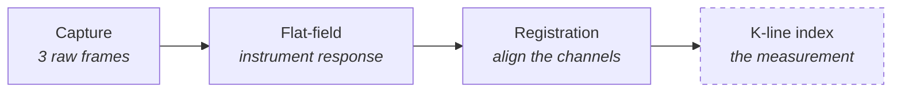

# Purpose of this document

This walks through the payload as it stands and the processing chain behind
it, one stage at a time, showing what goes into each stage and what comes
out. Every figure is a real capture from the current hardware, not an
illustration.

It also states plainly what the instrument cannot yet do. **The narrowband
filters have not arrived, so no potassium measurement has been made.**
Everything shown here is engineering data: three cameras looking at the same
scene through no filters at all. That is deliberate — it is the only
condition under which the instrument can be checked against a known answer,
and that opportunity disappears the moment the filters go on.

# Where the payload stands

The imaging hardware is complete and working. Three **Sony IMX296**
global-shutter monochrome cameras (InnoMaker CAM-IMX296RAW), 1456 × 1088,
on a 3D-printed plate, feeding a single Raspberry Pi 4 through an Arducam
Multi Camera Adapter v2.2. The whole payload — cameras, Pi, and battery —
is bolted into one rigid package that flies as a unit.


Two things about this sensor choice matter for the science:

**Global shutter.** Every pixel is exposed at the same instant, so a moving
aircraft produces no rolling-shutter skew. On the previous colour sensors it
did.

**True monochrome.** There is no Bayer colour filter array over the pixels.
Nothing interpolates, and nothing attenuates the near-infrared band we care
about. Every photon that reaches a pixel is measured by that pixel.

Getting these to run was not straightforward: the Raspberry Pi kernel ships
no device-tree support for an IMX296 behind a camera multiplexer, so that
had to be written. It now works, and all three cameras enumerate and capture
reliably.

# The processing chain



Three stages are built and tested. The fourth is specified but not written,
because with no filters fitted it would return noise around 1.0 and there
would be no way to tell a correct implementation from a broken one.

The order is not arbitrary. Flat-fielding must come before registration:
the correction map describes the sensor's own pixels, so it has to be applied
while the frame is still in sensor coordinates. Registration moves the image,
and after that the map no longer lines up with what it describes.

# Stage 1 — Capture

**In:** an operator clicking Capture, or a timer.
**Out:** three JPEGs, one per camera, sharing a capture-event timestamp.

```
20260830_150216_444_cam0_762nm.jpg
20260830_150216_444_cam1_766nm.jpg
20260830_150216_444_cam2_770nm.jpg
```


The multiplexer is a switch, not a true multiplexer: the Pi's camera
interface can only talk to one sensor at a time, so the three channels are
captured in sequence rather than simultaneously. The whole cycle takes
**about 2 seconds**.

That number is the single biggest limitation in the instrument, and it is
discussed under [What is not solved](#what-is-not-solved).

> **A caution about the filenames.** The `762nm` / `766nm` / `770nm` in each
> filename is the *intended* filter assignment, not a measurement. With no
> filters fitted, all three channels record identical broadband light. The
> labels will be updated to the real wavelengths when the filters are
> installed; until then, any analysis treating these as spectral channels
> will produce nonsense.

# Stage 2 — Flat-field correction

**In:** raw frames, plus a calibration built from a flat capture (uniform
featureless target) and a dark capture (lens caps on).
**Out:** frames with the instrument's own signature removed.

Each camera delivers a different amount of light to each part of its frame.
Lenses fall off toward the corners, and no two lenses or sensors are quite
identical. Since the potassium measurement is a *ratio between channels*, any
such difference is mathematically indistinguishable from real spectral
structure. The correction is:

$$\text{corrected} = (\text{raw} - \text{dark}) \times \text{gain},
\qquad \text{gain}(x,y) = \frac{\text{target}}{\text{flat} - \text{dark}}$$


The tool is written and validated. Against a synthetic test set with known
errors deliberately injected — channel gains of 1.00 / 1.35 / 0.85, per-camera
dark offsets, and a vignetting profile — it recovered them exactly:

| | before correction | after correction |
|---|---|---|
| channel spread (flat) | 58.8% | **0.00%** |
| cam1 / cam0 per pixel | 1.3707 | **1.0000** |
| cam2 / cam0 per pixel | 0.8849 | **1.0000** |

with residual scatter equal to the injected noise — no systematic error left.

## Two honest findings from calibrating the real instrument

**The channels already agree to about 2%.** Measured on the same pixels of
the same scene, the three cameras read 109.8, 111.8 and 109.3 — a 2.3%
spread. They are near-identical parts with near-identical optics, so most of
the instrument signature cancels in the ratio before any correction is
applied. Flat-fielding here is a refinement, not a rescue, and any
calibration has to beat that 2% baseline to be worth applying.

**The flat we have is not good enough to apply.** The first attempt used
paper resting on the lenses as a diffuser. That turns out to be an invalid
flat: light entering at wide angles from a diffuser touching the front
element exaggerates the lens falloff, and the flat reported **6–37% more
vignetting than the same lens sees on a real distant scene**. Correcting with
it over-corrects, by a different amount on each camera, which made the
channel ratio worse rather than better.

The fix is a distant uniform source — even overcast sky, or an evenly lit
white panel several feet away — and it is a ten-second capture once
conditions allow. The correction has to be re-derived through the filters
anyway, since filter transmission varies unit to unit and will not cancel the
way matched lenses do.

# Stage 3 — Channel registration

**In:** three corrected frames from one capture event.
**Out:** three frames on a common pixel grid, cropped to the region visible
in all of them, plus a report of the shift applied.

The three cameras sit about 40 mm apart and are captured seconds apart, so
they do not see quite the same thing. Before the ratio can be evaluated, the
frames have to be aligned so that a given pixel is the same patch of ground
in all three.


Measured on that capture, the shifts onto the reference channel were
`(+33, +121)` and `(−89, +40)` pixels. The alignment model is a simple
translation, which is justified: measured rotation between channels is about
0.1° and scale about 1.005, both negligible.

Each fit is reported with a before-and-after correlation score so it shows
its own work, and frames too washed out or too featureless to align
reliably are flagged rather than silently accepted.

# Stage 4 — K-line index (specified, not built)

**In:** an aligned, corrected triplet.
**Out:** one number per pixel — the potassium line strength — as a map, plus
a three-point spectral plot for any selected region.

The filters on order are Thorlabs hard-coated bandpass units, 10 nm FWHM:

| Filter | Centre | Role |
|---|---|---|
| `FBH750-10` | 750 nm | continuum reference, below the line |
| `FBH770-10` | 770 nm | **on-line** — the K I doublet at 766.5 / 769.9 nm |
| `FBH780-10` | 780 nm | continuum reference, above the line |

This is a bracketing design: the two reference channels sit either side of
the line, so the continuum underneath it can be interpolated rather than
assumed. Since 770 nm sits two-thirds of the way from 750 to 780:

$$C_{770} = \tfrac{1}{3}S_{750} + \tfrac{2}{3}S_{780}
\qquad\qquad
\text{K index} = \frac{S_{770}}{C_{770}}$$

An index of 1 means no potassium emission; above 1 means the 770 nm channel
is carrying light the continuum cannot explain. That is the fire signature,
evaluated independently at every pixel.

# How this compares with the Resonon

The Pika XC2 is a true imaging spectrometer: hundreds of contiguous bands at
roughly 1–2 nm resolution, which is why it resolves the potassium doublet as
two distinct peaks 3.4 nm apart.

**This instrument cannot reproduce that, and will not.** A 10 nm filter
integrates both K lines together with the continuum around them into a single
number. Three points is not a spectrum, and the doublet can never be
resolved.

What it can do is different rather than lesser:

| | Pika XC2 | This payload |
|---|---|---|
| Spectral sampling | hundreds of bands, 1–2 nm | 3 bands, 10 nm |
| Resolves the K doublet | yes | no |
| Image formation | pushbroom — scans to build a frame | snapshot, full 2D field at once |
| Output | spectrum per pixel | K-line index map over the whole scene |
| Cost, mass, power | laboratory instrument | three cameras and a Pi |

The claim being tested is not that three cameras match a spectrometer. It is
that three cameras, correctly calibrated, can detect *the same fire* the
spectrometer detects — at a cost and weight that a drone can carry routinely.

**A side-by-side against the Pika on the same burn is the single most
valuable measurement available to this project**, and it is worth arranging
before anything else on the list below. It is the experiment that either
supports the thesis or does not.

## The risk worth stating up front

The potassium lines are intrinsically narrow — well under a nanometre even
with broadening in a flame. A spectrometer at 1–2 nm resolution concentrates
that energy into one or two bands, which is why the spikes are so clear in
the Pika data. A 10 nm filter spreads the same line energy across ten
nanometres of mostly continuum, **diluting the contrast by roughly five to
ten times** relative to what the Pika sees.

That does not mean it will not work. It means the signal to look for is a
modest percentage excess in the 770 nm channel, not an obvious spike — and it
is why the calibration work above matters as much as it does. A 2% channel
error is tolerable against that signal; a 35% one would not be.

# What is not solved

**Capture is sequential, and slow.** About 2 seconds for all three channels.
On a moving aircraft the scene shifts between them, which is what registration
exists to correct — but registration can only correct a global shift, and at
close range different depths move by different amounts. In the 2026-08-29
flight data, channel offsets reached several hundred pixels.

The most promising route out of this is that these camera modules carry
**hardware trigger and strobe pins**. If all three can be fired from one
trigger they expose simultaneously, which does not merely reduce the
inter-channel displacement but eliminates it, and with it the need for
per-triplet registration on a moving platform. This has not been attempted.

**Boresight alignment.** One camera points roughly 120 px higher than the
others, beyond what parallax explains. After cropping to the common region
this costs about 25% of the sensor area. It is a mechanical adjustment to the
plate, not something software can recover.

**Flight radio link.** During the August flight the WiFi control link became
unusable as soon as the aircraft gained altitude. Ground testing at range is
needed to separate antenna blockage from interference.

# Status summary

| Item | State |
|---|---|
| Three-camera capture, IMX296 global shutter mono | working |
| Live focus through the web interface | working |
| Web interface: capture, gallery, settings, timer | working |
| Flat-field and dark correction | **tool built and validated; awaiting a valid flat** |
| Channel registration | working |
| K-line index | specified, not built — waiting on filters |
| Narrowband filters (750 / 770 / 780 nm) | on order |
| Fire response | **not tested — no filters** |
| Simultaneous capture via hardware trigger | not attempted |

# Next steps, in order of value

1. **Fit the filters and re-derive the flat-field calibration through them.**
   Nothing about the science is demonstrated until this happens.
2. **Image a burn alongside the Pika XC2.** The comparison that tests the
   whole premise.
3. **Investigate hardware-triggered simultaneous capture.** Would remove the
   dominant error source on a moving platform.
4. **Correct the boresight offset** on the camera plate to recover the lost
   frame area.
5. **Characterise the radio link** on the ground at range before the next
   flight.
