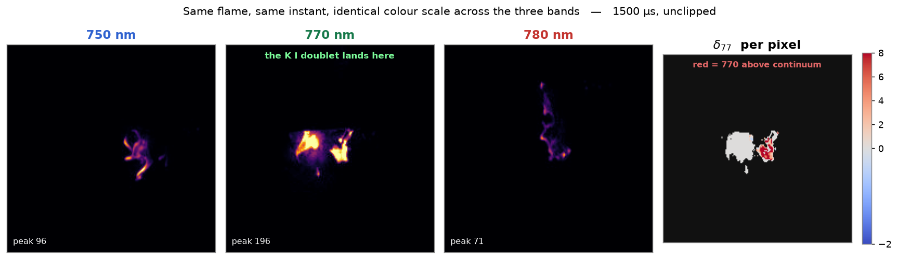
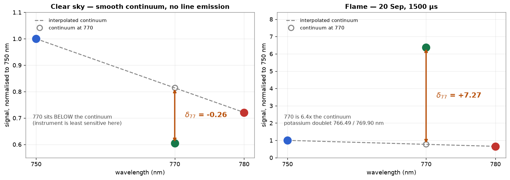
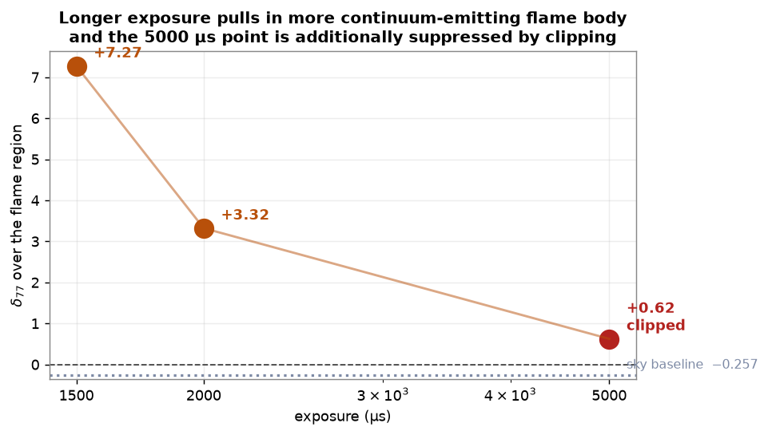
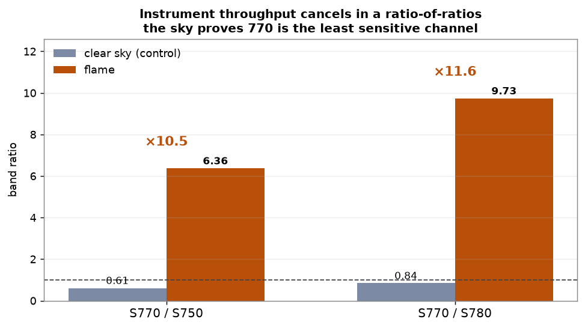
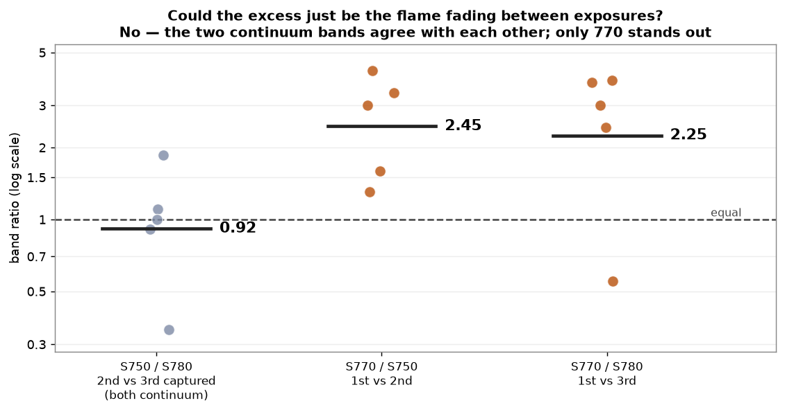

# First potassium detection

*Narrowband K-line payload v0.3 · burn of 20 September 2026 · written 20 Sep 2026*

On the evening of 20 September the payload photographed a small open flame in
darkness and recorded **a strong emission excess in the 770 nm channel that is
not present in either continuum band.** That is the potassium signature the
instrument was built to find, and this is the first time the project has seen
it.

This page is the evidence, the controls that were run against it, and an
honest account of what is not yet established.

---

## 1. The result in one picture



All three panels use an **identical colour scale**, so brightness differences
are real and not a display choice. The flame is several times brighter at
770 nm than at 750 or 780 nm. The rightmost panel is the per-pixel index,
δ<sub>77</sub>, over the pixels bright enough to evaluate.

The potassium doublet — K I at **766.49 nm and 769.90 nm** — falls inside the
770 nm filter's 10 nm passband. Neither continuum filter contains it.

---

## 2. What δ<sub>77</sub> measures

The index asks a single question: **is there more light at 770 nm than the
neighbouring bands say there should be?**

$$\delta_{77} = \frac{S_{770} - C_{770}}{C_{770}}, \qquad
C_{770} = \tfrac{1}{3}\left(S_{750} + 2\,S_{780}\right)$$

$C_{770}$ is the continuum *interpolated* under the line from the two bands
either side. A source with a smooth spectrum gives δ<sub>77</sub> ≈ 0. A
source with potassium emission gives a positive value.



The two panels are the whole argument. **Left**, clear sky: a smooth
Rayleigh continuum falling with wavelength, and 770 sits *below* the
interpolated line. **Right**, the flame: 770 sits **6.4× above** it.

---

## 3. The measurement

Integrated over one common region, defined from the sum of all three bands so
no single channel decides where the flame is, background subtracted from a
surrounding annulus:

| Exposure | S<sub>750</sub> | S<sub>770</sub> | S<sub>780</sub> | δ<sub>77</sub> | clipped? |
|---|---:|---:|---:|---:|---|
| 1500 µs | 9.2k | **58.7k** | 6.0k | **+7.27** | no |
| 2000 µs | 37.2k | **276.7k** | 77.5k | **+3.32** | no |
| 5000 µs | 371k | 625k | 392k | +0.63 | **yes** |

The 5000 µs row is saturated. Clipping truncates the brightest channel
hardest — which here is 770 — so that number is biased *downward* and should
not be quoted. **The two unclipped rows are the measurement.**

### Why δ<sub>77</sub> falls as exposure rises



This is expected, not a problem. A longer exposure brings more of the cooler,
continuum-emitting flame body above the detection threshold, which dilutes the
line-emitting core. **δ<sub>77</sub> is therefore aperture-dependent for an
extended source** and any quoted figure has to state the region it was
measured over. It does not affect whether the line is there.

---

## 4. Control 1 — it is not the instrument

The obvious objection is that the three channels have never been
flat-fielded, so their relative throughput is unknown. Could 770 simply be
the most sensitive channel?

**No, and we can prove it points the other way.**



| | S<sub>770</sub>/S<sub>750</sub> | S<sub>770</sub>/S<sub>780</sub> |
|---|---:|---:|
| Clear sky (smooth continuum) | 0.605 | 0.839 |
| Flame | **6.365** | **9.731** |
| **Enhancement** | **×10.5** | **×11.6** |

On clear sky — a smooth source with no line emission — **770 is the dimmest
of the three channels.** The instrument is *least* sensitive exactly where the
potassium line falls. Per-channel throughput cancels in a ratio-of-ratios, so
this comparison needs no flat field at all, and the conclusion is conservative:
the true excess is larger than measured, not smaller.

An uncalibrated gain difference cannot flip a channel from dimmest to
brightest by an order of magnitude. Only the source can do that.

---

## 5. Control 2 — it is not the flame flickering

A harder objection. The multiplexer reads one camera at a time, so the three
bands are exposed about **two seconds apart**, always in the order
**770 first, then 750, then 780**. A flame that faded during the sequence
would make the first-captured channel brightest every time — which would look
exactly like a 770 excess.

The test is to ask what the *two continuum bands* do. They are captured 2 s
and 4 s after 770. If the flame were fading, they should differ from each
other by a similar margin.



| Ratio | Captured | Geometric mean | Spread |
|---|---|---:|---:|
| S<sub>750</sub>/S<sub>780</sub> | 2nd vs 3rd | **0.92** | ×1.84 |
| S<sub>770</sub>/S<sub>750</sub> | 1st vs 2nd | **2.45** | ×1.65 |
| S<sub>770</sub>/S<sub>780</sub> | 1st vs 3rd | **2.25** | ×2.24 |

**The two continuum bands agree with each other to 0.92** — slightly *below*
1.0, meaning the last-captured band is marginally brighter than the middle
one. There is no monotonic fade. Yet 770, captured first, sits **2.25–2.45×
above both**, well outside the flame's own wobble.

Flame variation is real and it is why the spread is wide. It cannot produce a
systematic factor of 2.3 in one specific band while leaving the other two
equal to each other.

> Taking the session as a whole rather than the single best capture gives a
> more conservative headline: **δ<sub>77</sub> ≈ +1.3**, against ≈ 0 expected
> for a thermal source. Individual unclipped captures run as high as +7.3.

---

## 6. Control 3 — the instrument reads ≈ 0 when it should

Three independent null results, all from the same hardware:

| Scene | δ<sub>77</sub> | What it should read |
|---|---:|---|
| Lit room, no flame (`111405`) | **−0.008** median | ≈ 0 ✓ |
| Clear sky, 17 Sep | **−0.257** | ≈ 0, offset by uncorrected instrument response ✓ |
| Embers only, no flame (`111918`) | **−0.294** | matches the sky baseline ✓ |

That third row is the most valuable. It is the **same fire, same session,
minutes later**, once the flame had died back to glowing embers. Embers are a
thermal source — hot, bright, and with no potassium emission. The index drops
from +2.9 to −0.29, landing on the same baseline the sky gives.

**The instrument distinguishes a flame from equally hot embers.** That is
detection, not just brightness.

---

## 7. The whole session

48 capture events between 11:06 and 11:20 UTC, 44 of them inside exposure
brackets spanning 50 µs to 8000 µs.

| | |
|---|---|
| Capture events | 48 |
| Bracketed, with per-frame statistics | 44 |
| Unclipped **and** above the noise floor | 7 |
| Of those, δ<sub>77</sub> > +0.5 | **4** |
| Null results (embers, lit room) | 2, both ≈ 0 |

Most events are "below noise" because the flame was small, the scene was
black, and the manifest records the frame mean to three decimals — which is
too coarse when the mean is 0.0004. **That is a tooling limitation, not a
measurement one**, and it is the single easiest thing to fix before the next
burn.

---

## 8. What this does *not* establish

Stated plainly, because the result is strong enough that the caveats matter.

**No absolute calibration.** There is still no valid flat field. δ<sub>77</sub>
is a *relative* index here. The sky control shows the uncorrected instrument
response offsets it by roughly −0.26, and the field response varies by about
0.27 across the frame. The flame sat near the frame centre where that is
best behaved, but the number is not yet traceable to anything.

**No simultaneity.** The 2 s inter-channel gap is real and the flame visibly
changes shape between bands — compare the three panels in §1. The controls in
§5 show this cannot explain the excess, but it is why the per-pixel map in §1
is a diagnostic and not a product. **Integrated flux over a common region is
the only defensible measure from this data.**

**8-bit JPEG.** No raw path exists in the daemon. Thin for a ratio measured
between three channels, especially at low signal.

**One fire, one night, one fuel.** Nothing here says what the index does
against a different fuel, at range, in daylight, or from the air — which is
the case the instrument actually has to work in. Daylight is much harder: the
continuum bands will carry reflected sunlight, and the excess will be a small
percentage rather than a factor of six.

---

## 9. What to do next

1. **Fix the manifest precision.** Record frame statistics to enough digits to
   be useful on a dark scene. Most of this session was thrown away by rounding.
2. **Get the sky flat.** It has been the top open item for a week and is now
   the only thing standing between a relative index and a calibrated one.
3. **Repeat with the capture order reversed.** Shooting 780 → 750 → 770 would
   close the §5 control completely rather than inferring it.
4. **Burn a potassium-free fuel** as a negative control. A clean alcohol flame
   should read ≈ 0 where wood reads strongly positive. That is the experiment
   that turns this from a detection into a discriminator.
5. **Then daylight, then altitude** — in that order, because each is harder
   than the last.

---

## Reproducing this

```bash
tools/register_triplets.py ./burn_20260920 -o ./aligned --no-crop
tools/k_index.py ./aligned -o ./kindex
```

Raw frames are on the payload under `~/payload_images/20260920_*`, with
per-frame statistics in the `bracket_20260920_*.csv` manifests.

**Related:** [`alignment_method.md`](alignment_method.md) ·
[`k_line_primer.md`](k_line_primer.md) ·
[`filter_assignment.md`](filter_assignment.md)
